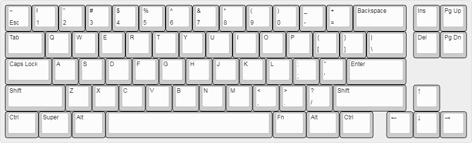

# Dev-68

A 68-key development keyboard designed for working on the [Xebow](https://github.com/ElixirSeattle/xebow) firmware.

- [Layout](http://www.keyboard-layout-editor.com/##@@=~%0AEsc&=!%0A1&=%22%0A2&=%23%0A3&=$%0A4&=%25%0A5&=%5E%0A6&=%2F&%0A7&=*%0A8&=(%0A9&=)%0A0&=%2F_%0A-&=+%0A%2F=&_w:2%3B&=Backspace&_x:0.25%3B&=Ins&=Pg%20Up%3B&@_w:1.5%3B&=Tab&=Q&=W&=E&=R&=T&=Y&=U&=I&=O&=P&=%7B%0A%5B&=%7D%0A%5D&_w:1.5%3B&=%7C%0A%5C&_x:0.25%3B&=Del&=Pg%20Dn%3B&@_w:1.75%3B&=Caps%20Lock&=A&=S&=D&=F&=G&=H&=J&=K&=L&=%2F:%0A%2F%3B&=%22%0A'&_w:2.25%3B&=Enter%3B&@_w:2.25%3B&=Shift&=Z&=X&=C&=V&=B&=N&=M&=%3C%0A,&=%3E%0A.&=%3F%0A%2F%2F&_w:2.75%3B&=Shift&_x:0.25%3B&=%E2%86%91%3B&@_w:1.25%3B&=Ctrl&_w:1.25%3B&=Super&_w:1.25%3B&=Alt&_w:6.25%3B&=&_w:1.25%3B&=Fn&_w:1.25%3B&=Alt&_w:1.25%3B&=Ctrl&_x:0.5%3B&=%E2%86%90&=%E2%86%93&=%E2%86%92)

